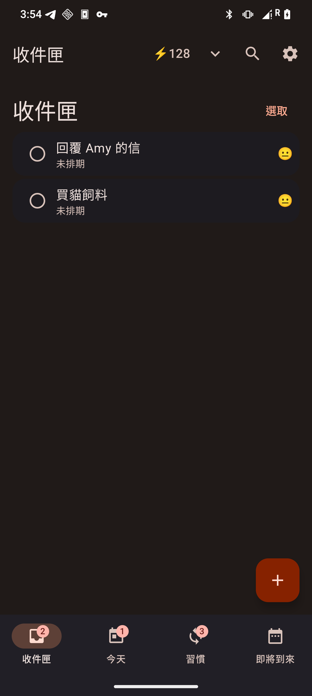
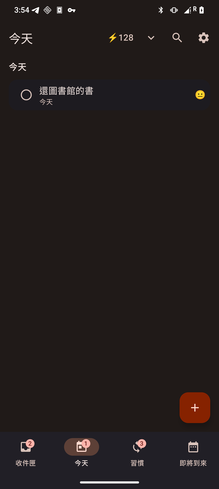
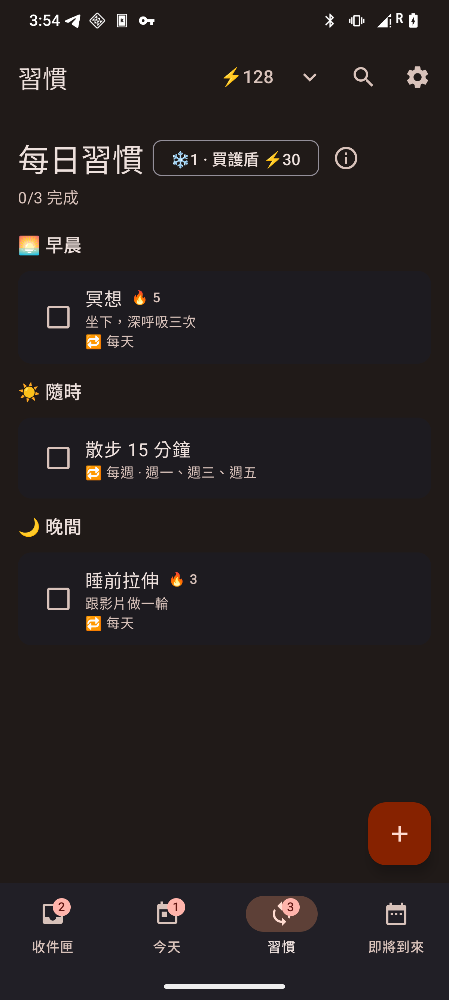
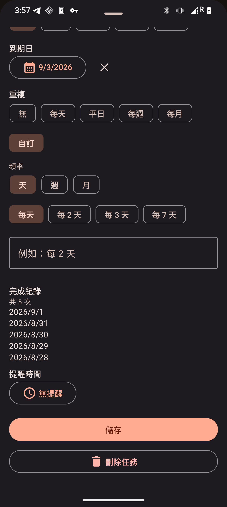
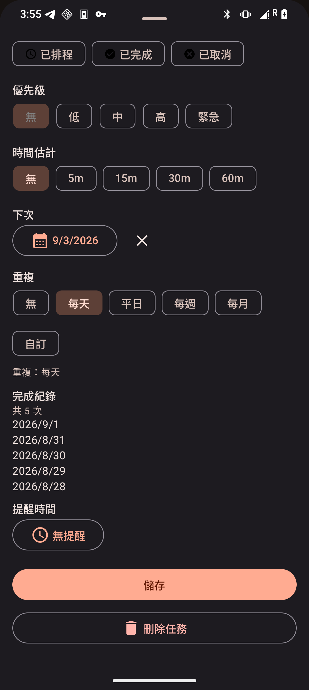
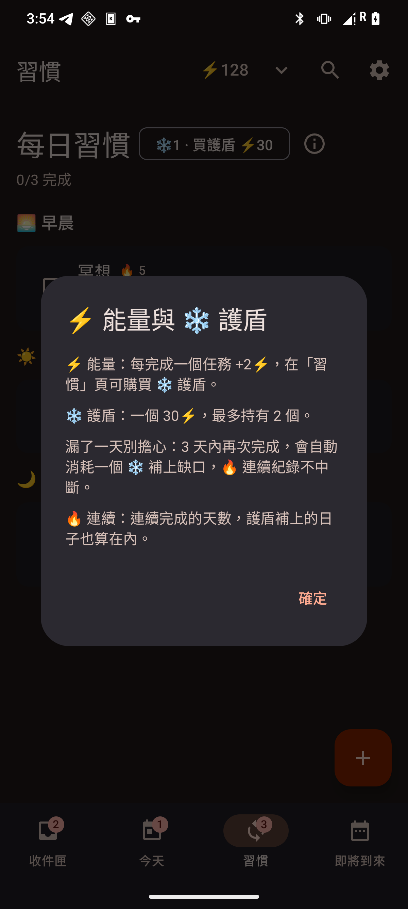

# Tsosu 做事

[繁體中文](README.zh-TW.md) · [🌐 Website](https://soanseng.github.io/tsosu/)

> 台語「做事」(tsò-sū) — A task manager designed by a psychiatrist with ADHD.

**Tsosu** is a native Android task manager built for minds that work differently. It stores everything as plain markdown files in the [Obsidian Tasks](https://publish.obsidian.md/tasks/Introduction) format — edit on your phone, then open the same vault on your desktop in Obsidian, nvim, or any text editor. No server needed.

<p>



</p>
<p>



</p>

## Why Tsosu?

Most task managers are designed for neurotypical brains. They punish you with overdue counters, bury you under options, and make you feel guilty when you fall behind.

Tsosu is different. It's built on clinical understanding of ADHD and the principles of Atomic Habits — **make it small, make it easy, celebrate progress.** Four tabs, zero nested menus, and a gamification loop that rewards showing up instead of shaming you for missing a day.

## What's New in 1.3

- **🗂 A calmer home** — Inbox is the start screen; the app is four tabs (Inbox / Today / Habits / Upcoming) plus Calendar and Categories tucked into the top-bar menu. Focus timers, kanban boards, weekly review and saved filters are gone — deliberately.
- **🤝 Obsidian Tasks compatibility** — `tasks.md` lines are now written and parsed in the plugin's native emoji format (`🆔` ids, `🔁 every week on Tuesday`, `⛔` dependencies, full date set). Complete a recurring task in Obsidian and Tsosu folds the done line into your streak history on the next sync — and vice versa.
- **☑️ Tick-box recurrence builder** — "Custom" recurrence is now chips: every N days / weeks / months, weekday multi-select, day-of-month. Natural language (`every 2 days`, `每週一二三`) still works.
- **📜 Completion history** — open any task to see how many times and when it was completed (compact past 5).
- **❓ Gamification, explained** — the ⚡ in the top bar is tappable, the Habits tab has an ⓘ, and Settings has an entry; all three explain how energy, shields and streaks work.
- **⛔ Dependencies & ⏳/🛫 dates** — Obsidian's `dependsOn`, scheduled and start dates are read, stored and shown.
- **🗂 Categories** — give a task a category (papers, self-growth, …) from the quick-add row, the `@category` token, or the chips in the detail sheet; the top-bar ⌄ menu has a **Categories** view that groups open tasks by category.
- **✏️ Editable routine slot** — the 🌅/☀️/🌙 slot is now editable after creation, not only when adding.

## Install

### Via Obtainium (recommended)

[Obtainium](https://github.com/ImranR98/Obtainium) tracks this project's GitHub Releases directly — install once, and new versions are auto-detected for update.

1. Install Obtainium (Google Play or F-Droid)
2. Open Obtainium, tap the **＋** button to add an app
3. Set the app source to **GitHub**, enter `soanseng/tsosu`
4. Tap **Add** — the latest APK downloads automatically

### Direct download

Grab the latest `.apk` from the [Releases page](https://github.com/soanseng/tsosu/releases). Android will ask for the "install unknown apps" permission — allow it and install.

## The App

### 📥 Inbox → 📅 Today → 🔁 Habits → 🗓 Upcoming

Four tabs, one mental model:

- **Inbox** — everything you captured with no date yet. Clear it, don't fear it.
- **Today** — overdue and due-today in two gentle sections. A task due today is never labelled "overdue".
- **Habits** — every recurring task, grouped by 🌅 morning / ☀️ anytime / 🌙 evening, with 🔥 streaks. **A habit in Tsosu is just a task with a recurrence rule** — one unified model, no separate habit database.
- **Upcoming** — what's ahead. Calendar lives in the top-bar ⌄ menu.
- **Categories** — also in the ⌄ menu: every open task grouped by its category, with an "uncategorized" bucket at the end. Categories are projects in the vault, so they round-trip to Obsidian like everything else.
- **Read first, edit on purpose** — a task row shows the first line of its description, so you rarely need to open one. Tap a task for a read-only view (status, dates, category, description, and every link found in it); tap **Edit** when you actually want to change something.

### ⚡ Energy, ❄ Shields, 🔥 Streaks — momentum without guilt

- Completing a task earns **+2⚡**. A **❄ shield** costs ⚡30 (hold at most 2).
- Missed a day? Complete the habit again within 3 days and a ❄ is spent automatically to bridge the gap — your 🔥 survives.
- Tap the ⚡ in the top bar (or the ⓘ on the Habits tab, or the Settings entry) for this exact explanation in the app.
- Streak days include shield-bridged days. No red screens, no guilt counters.

### ✍️ Quick-Add Syntax — "Type it like you say it."

Todoist-style keywords parsed straight from the task title:

- **Recurrence**: `every day`, `weekly`, `every mon, wed, fri`, `每 2 天`, `每週一二三` — or build it with chips in the Custom picker
- **Time of day**: `every morning` / `every afternoon` / `every evening` — recurrence plus a preset reminder (08:00 / 13:00 / 18:00 / 21:00)
- **Bounds**: `starting 8/20 until 8/31`; priority shorthand `p1`–`p4`; `@project` to file; `due:today` / `due:8/31`
- The same words work in your vault: write `Buy milk every other week` in Obsidian and the next sync carries the rule

### ⏰ Reminders & digests

Per-task reminder time, snooze from the notification, morning & evening digest, alarms that survive reboot and timezone changes.

### 🧰 Settings worth keeping

JSON backup & restore, ICS calendar subscriptions (read-only overlay) and ICS export, Todoist & TickTick CSV import, biometric app lock, English / 繁體中文, Material You theming.

## Markdown Vault — the Obsidian Tasks format

Point Tsosu at any folder (an Obsidian vault is ideal). It writes:

```
<your vault folder>/
├── tasks.md              # checkbox line per task, grouped by project
├── tasks/
│   └── <slug>-<id8>.md   # per-task note when a task has a description
└── daily/
    └── YYYY-MM-DD.md     # daily note — today's habit checklist
```

A task line uses the [Obsidian Tasks](https://publish.obsidian.md/tasks/Introduction) default emoji format, in the plugin's canonical field order:

```markdown
- [ ] Prepare presentation 🆔 ghi-789 ⏫ 🔁 every week ➕ 2026-09-01 🛫 2026-09-02 ⏳ 2026-09-03 📅 2026-09-04
- [x] Call dentist 🆔 def-456 ➕ 2026-03-20 📅 2026-03-22 ✅ 2026-03-22
```

| Marker | Meaning |
|--------|---------|
| `- [ ]` `[/]` `[!]` `[>]` `[x]` `[-]` | todo / in-progress / on-hold / planned / done / cancelled |
| `🆔 id` | stable task id (also accepts the legacy `<!-- id:... -->`) |
| `⛔ id1,id2` | depends on other tasks |
| `🔺 ⏫ 🔼 🔽 ⏬` | priority — note: Tsosu reads `⏫` as its top level (URGENT), one notch above the same emoji's meaning in Obsidian |
| `🔁 every …` | recurrence, rrule.js English — `every day`, `every 2 weeks on Monday, Friday`, `every month on the 15th` |
| `➕ 🛫 ⏳ 📅 ❌ ✅` | created / start / scheduled / due / cancelled / done dates |
| `[[tasks/slug]]` | link to the per-task note (tasks with a description) |
| `<!-- conflict -->` | edited on both sides; vault version was kept |

Tsosu-only fields (⏰ reminder, energy, 🍅 estimate, tiny habit versions, completion history) are not written on the task line — they live in SQLite and in the per-task note's YAML frontmatter, so the line stays native to Obsidian.

### Completing recurring tasks from either side

Obsidian's model splits a completed occurrence into a `[x] … ✅ date` line plus a fresh `[ ]` line; Tsosu's model is one row with a completion history. Both are handled:

- **In Obsidian**: leave the done line and the spawned line — Tsosu folds them by `🆔` on the next sync: the `[ ]` line becomes the next occurrence, each `✅` date becomes one completion in the history.
- **In Tsosu**: the index keeps the 10 most recent completions of each series as `[x]` history lines above the active line, so a Tsosu rewrite never erases your Obsidian-side history.
- Full completion history (uncapped) lives in the per-task note YAML and in the app.

### Cross-device

New to the plugin? The website has a [four-step Obsidian Tasks quick start](https://soanseng.github.io/tsosu/#obsidian-guide).

| Where | How |
|-------|-----|
| **Phone** | Tsosu app — capture, habits, streaks, reminders |
| **Desktop** | Obsidian with the [Tasks plugin](https://publish.obsidian.md/tasks/) — queries, board views, editing |

```markdown
```tasks
not done
path does not include daily
group by due
```
```

Sync the folder with [Syncthing](https://syncthing.net/) or Obsidian Sync. Vault edits are auto-detected — no manual sync button. Tsosu never writes into `.obsidian/`.

## Technical Details

- **Android native** — Kotlin, Jetpack Compose, Material 3
- **Local-first** — works 100% offline, no account, no analytics, no tracking
- **Markdown sync** — Obsidian Tasks-compatible plain `.md`
- **Calendar** — device calendar provider (Google, CalDAV via sync clients), ICS subscriptions
- **Localization** — English, 繁體中文
- **Architecture** — MVVM, Clean Architecture, TDD

## Who Made This?

Tsosu is designed by a **board-certified psychiatrist** who also lives with ADHD. Every design decision comes from both clinical expertise and personal experience with executive function, time blindness, and decision fatigue.

This isn't a productivity app that happens to have some ADHD features. ADHD-friendly design IS the product.

## License

Tsosu is a proprietary application.

---

*tsosu.app — 做事，用你的方式。*
*Getting things done, your way.*
